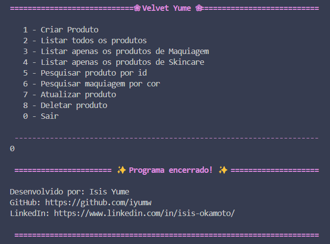

# Projeto Final - Bloco 01

Este repositório contém o projeto final do Bloco 01, desenvolvido como parte do curso da Generation.

## Descrição

Este projeto é uma aplicação de CRUD (Create, Read, Update, Delete) desenvolvido em TypeScript, utilizando conceitos de Programação Orientada a Objetos (POO) e Herança. A estrutura é baseada em três classes principais:

- Produto (classe base): Representa a entidade genérica de um produto.
- Maquiagem (subclasse): Extensão da classe Produto, com características específicas para itens de maquiagem.
- Skincare (subclasse): Extensão da classe Produto, focada em produtos de cuidados com a pele.

A aplicação apresenta uma interface de terminal interativa que permite o gerenciamento completo dos produtos.




## Funcionalidades

1. **Criar Produto**: Permite a criação de novos produtos, especificando atributos como tipo, cor, nome e categoria.

2. **Listar todos os produtos**: Exibe uma lista completa de todos os produtos cadastrados.

3. **Listar apenas os produtos de Maquiagem**: Filtra e exibe apenas os produtos que pertencem à categoria de maquiagem.

4. **Listar apenas os produtos de Skincare**: Filtra e exibe apenas os produtos que pertencem à categoria de skincare.

5. **Pesquisar produto por ID**: Permite a busca de um produto específico a partir do seu ID único.

6. **Pesquisar maquiagem por cor**: Realiza uma busca específica por produtos da categoria de maquiagem com base na cor.

7. **Atualizar produto**: Permite editar os atributos de um produto existente, como nome, cor ou categoria.

8. **Deletar produto**: Remove um produto específico do banco de dados utilizando seu ID.

9. **Sair**: Encerra a aplicação.

## Tecnologias Utilizadas

- **TypeScript**: Linguagem principal utilizada para tipagem estática e organização do código.  
- **TS-Node**: Permite executar arquivos TypeScript diretamente no Node.js.  
- **Readline-Sync**: Para entrada interativa de dados via terminal.

## Pré-requisitos

Certifique-se de ter instalado:
- [Node.js](https://nodejs.org/)
- TypeScript (instalado globalmente):
  ```bash
  npm install -g typescript
## Instalação

1. **Clone o repositório:**

   ```bash
   git clone https://github.com/iyumw/projeto-final-bloco01.git
2. **Instale as dependências:**
	```bash
	npm install
3. **Execute o programa:**

	```bash
	ts-node Menu.ts
